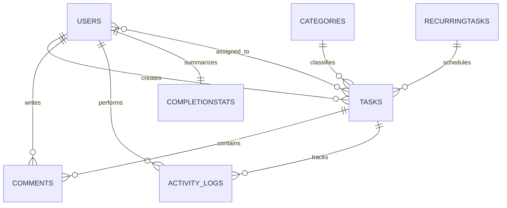

# Schema Notes

The backend now uses MongoDB, so these are collection-level design notes rather than relational normalization notes.

## Collections

- `users`
- `categories`
- `recurringtasks`
- `tasks`
- `comments`
- `activitylogs`
- `completionstats`

## Key Rules

- `users.email` is unique.
- `tasks.status` is limited to `pending`, `in-progress`, or `completed`.
- `tasks.priority` is restricted to `1..5`.
- `completionstats.completedCount` is a stored numeric field with minimum `0`.
- Task, comment, activity-log, and recurring references are stored as `ObjectId`.

## Indexing

- `users.email`
- `tasks.createdBy`
- `tasks.categoryId`
- `tasks.status`
- `tasks.status + dueDate`
- `comments.taskId`
- `activitylogs.taskId`
- `completionstats.userId`

## Aggregation Reports

1. Workload report:
   Counts assigned and overdue tasks per user.
2. Category completion report:
   Computes total tasks and completion rate per category.
3. Completed-by-others report:
   Reads from `completionstats` and excludes the current user.

## ER Diagram

